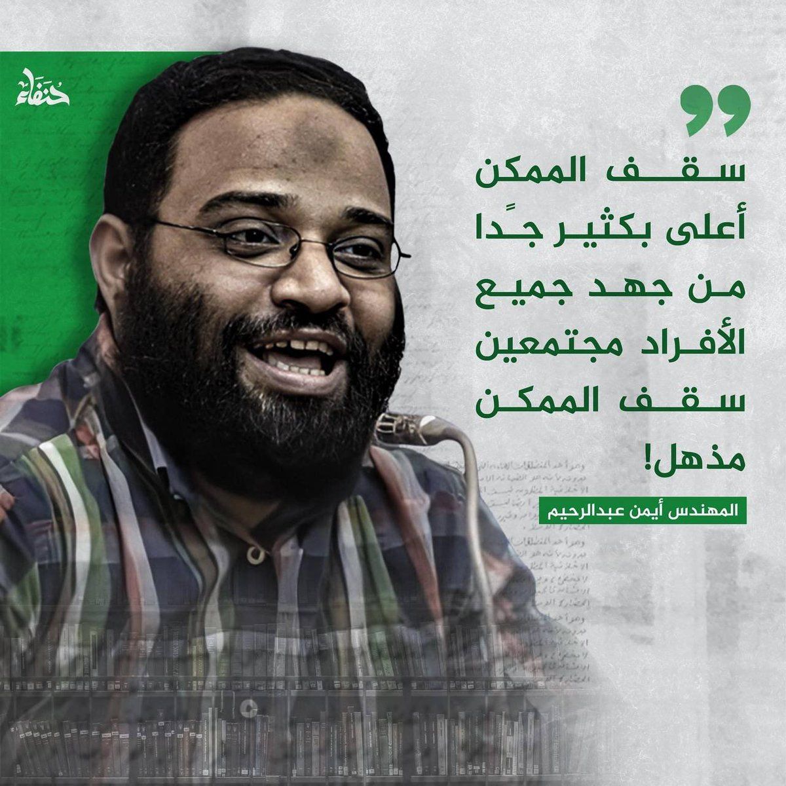

# Helpers Assiut Summer Camp II

[](https://www.facebook.com/share/1AW6CKZv3B/)

## 🎯 About The Camp

**Helpers Assiut Summer Camp II**
This comprehensive programming camp teaches C# and .NET fundamentals from scratch to advanced levels, designed for beginners and intermediate learners who want to build a strong foundation in object-oriented programming, database systems, and application development.



---

## 📚 Camp Content

### 📅 **Week 1: C#.NET Foundation**

- Basic Structure of C# Programs
- Console Class Methods and Properties
- Data Types, Variables & Operators
- Control Flow Statements (If-Else, Switch, Loops)
- Functions and User Input/Output
- Command Line Arguments
- **Materials**: [Week01.md](Week01.md)

### 📅 **Week 2: Advanced Basics & Exception Handling**

- String Handling & Memory Management (Stack vs Heap)
- Exception Handling (Try-Catch-Finally, Multiple Catch Blocks)
- Arrays and 2D Arrays
- Collections and ArrayList
- **Version Control with Git/GitHub**
- **Materials**: [Week02.md](Week02.md)

### 📅 **Week 3: Structs, Constructors & Properties**

- Functions Review & Parameter Passing
- Pass by Value vs Pass by Reference
- Structs and Constructors
- Enums and Arrays
- Properties in C#
- **Materials**: [Week03.md](Week03.md)

### 📅 **Week 5: OOP Fundamentals & Database Basics**

- Object-Oriented Programming Day 1
- Classes, Objects, and Encapsulation
- Access Modifiers & Constructors
- Method Overloading & Static Members
- **Database Fundamentals & DBMS Types**
- **Materials**: [Week05.md](Week05.md)

### 📅 **Week 6: Advanced OOP & Database Systems**

- Object-Oriented Programming Day 2
- Inheritance, Polymorphism & Abstract Classes
- Interfaces and Method Overriding
- **SQL Introduction & Database Design**
- **Entity Relationship Diagrams (ERD)**
- **File-Based vs Database Systems**
- **Materials**: [Week06.md](Week06.md)

---

## 📁 Repository Structure

``` plaintext
📂 Helpers-Assiut-Summer-Camp-II
├── 📄 README.md
├── 📄 Week01.md
├── 📄 Week02.md  
├── 📄 Week03.md
├── 📄 Week05.md
├── 📄 Week06.md
├── 📂 Photo/
└── 📂 Code Examples/ (Coming Soon)
```

---

## 🚀 How to Use This Repository

1. **📥 Clone the Repository:**
    Open your terminal or command prompt and run:

   ```bash
    git clone https://github.com/3bdalrhmanS3d/Helpers.git
   ```

2. **📖 Follow Weekly Content:**
   - Start with Week01.md for C# fundamentals
   - Progress through Week02.md for advanced basics
   - Continue with Week03.md for structs and properties
   - Jump to Week05.md for OOP concepts
   - Complete with Week06.md for advanced OOP and databases

3. **💻 Practice Coding:**
   - Set up Visual Studio
   - Follow along with video sessions
   - Complete lab exercises and practical tasks

4. **📤 Submit Tasks:**
   - Complete mandatory tasks from video sessions
   - Submit before weekly deadlines

---

## 🏆 Learning Path & Outcomes 

### **Phase 1: C# Fundamentals (Weeks 1-3)**
By completing the first phase, you will master:
- ✅ C# syntax and basic programming concepts
- ✅ Exception handling and memory management
- ✅ Data structures (arrays, collections)
- ✅ Structs, constructors, and properties
- ✅ Git version control basics

### **Phase 2: OOP & Database Systems (Weeks 5-6)**
By completing the advanced phase, you will master:
- ✅ Object-Oriented Programming principles
- ✅ Advanced OOP concepts (Inheritance, Polymorphism)
- ✅ Database fundamentals and SQL basics
- ✅ Entity Relationship Diagram design
- ✅ Database vs File system comparisons

### **Overall Learning Outcomes:**
- ✅ Write clean, efficient, and maintainable C# code
- ✅ Apply all four pillars of Object-Oriented Programming
- ✅ Design and work with database systems
- ✅ Use version control systems effectively
- ✅ Build robust C# applications with proper error handling
- ✅ Apply industry-standard coding practices and principles

---

## 📊 Course Progression Map

```plaintext
Week 1: C# Basics           → Week 2: Advanced Concepts    → Week 3: Structs & Properties
   ↓                           ↓                             ↓
Console & Variables         Exception Handling            Functions & Constructors
Data Types & Operators      Arrays & Collections          Enums & Properties
Control Flow               Git/GitHub Integration         Parameter Passing
   ↓                           ↓                             ↓
Week 5: OOP Day 1          → Week 6: OOP Day 2 + Database Systems
   ↓                           ↓
Classes & Objects           Inheritance & Polymorphism
Encapsulation              Abstract Classes & Interfaces
Database Fundamentals      SQL & ERD Design
```

---

## 🎯 Study Recommendations

### **For Beginners:**
1. **Week 1-2**: Focus on understanding basic syntax and concepts
2. **Week 3**: Practice with structs and properties extensively
3. **Week 5-6**: Take time to fully grasp OOP concepts before proceeding

### **For Intermediate Learners:**
1. **Weeks 1-3**: Quick review, focus on advanced topics
2. **Weeks 5-6**: Deep dive into OOP principles and database design
3. **Practice**: Build personal projects applying learned concepts

### **For All Students:**
- 📝 **Code Daily**: Practice writing code every day
- 🎥 **Active Learning**: Code along with video sessions
- 👥 **Community**: Join discussions in Telegram group
- 📚 **Documentation**: Read official C# documentation
- 🔄 **Review**: Regularly revisit previous week materials

---

## 📬 Stay Connected - تواصل معنا

**Join our community and stay updated:**

[](https://www.facebook.com/share/1AW6CKZv3B/)
[](https://www.linkedin.com/company/the-helpers-ac/)
[](https://t.me/HelpersAU)

---

## 📝 Notes for Students

> **⚠️ Important:** This repository contains materials for Weeks 1, 2, 3, 5, and 6. Week 4 materials may be available separately or integrated into other weeks' content.

> **💡 Study Tips:**
> - Don't skip weeks - each builds upon previous knowledge
> - Practice coding alongside watching videos
> - Complete all lab exercises and assignments
> - Join the Telegram group for peer support and discussions

> **🎯 Success Factors:**
> - Consistent daily practice
> - Active participation in community discussions
> - Completing all mandatory assignments
> - Building personal projects using learned concepts

---

## 🌟 Acknowledgments

- **Helpers Assiut Community** for organizing this comprehensive programming camp
- **All instructors and mentors** who contributed valuable content and guidance
- **Students and participants** who make this learning community vibrant and supportive

---

<div align="center" >

### 💪 Ready to Start Your Programming Journey? 

**[Begin with Week 1 Fundamentals](Week01.md)** 🚀

---

*Made with ❤️ by Helpers Assiut Community*
*Building the next generation of skilled developers*
</div>